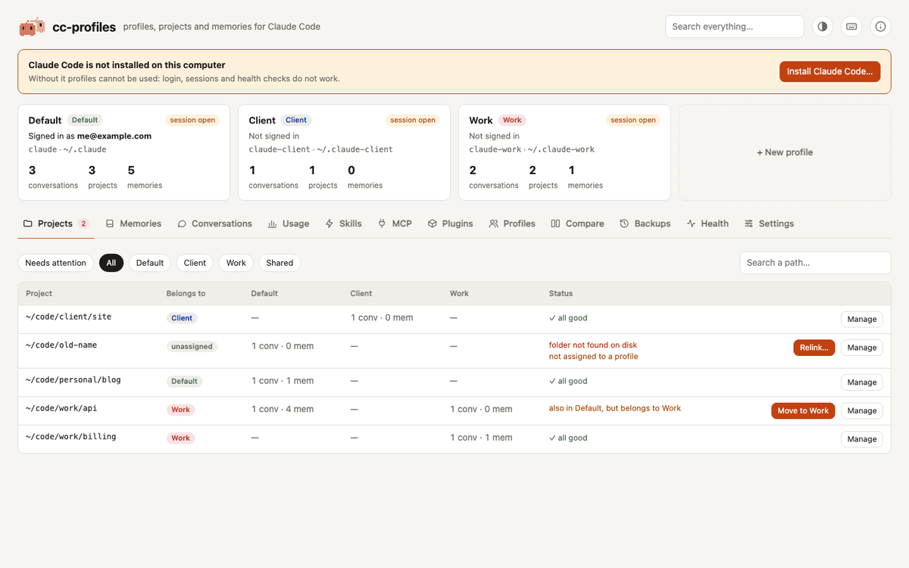
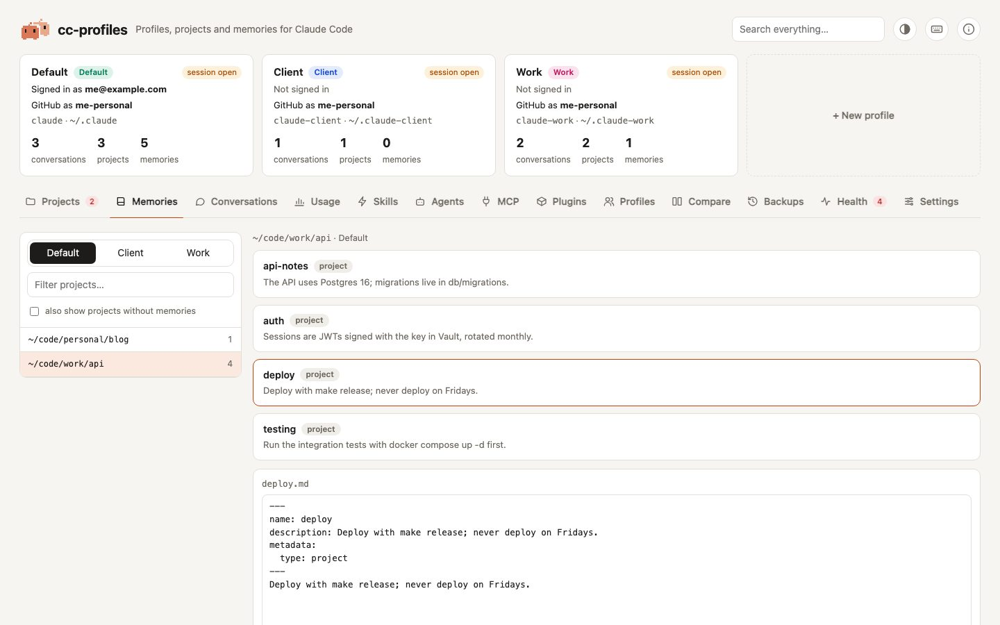
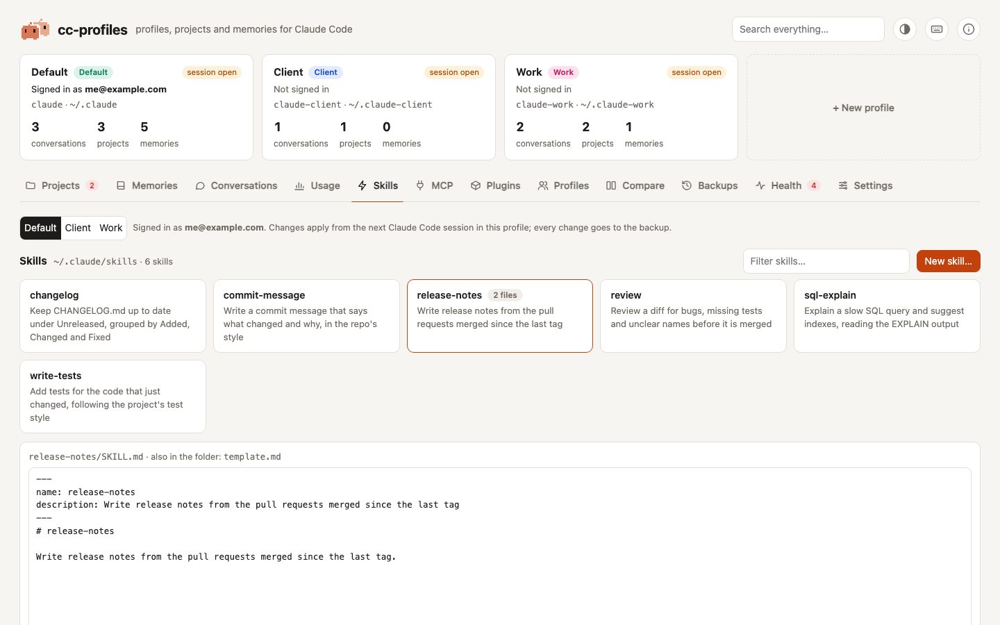
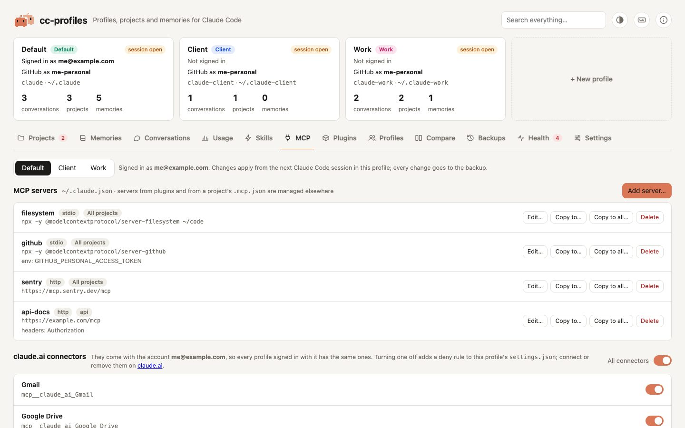
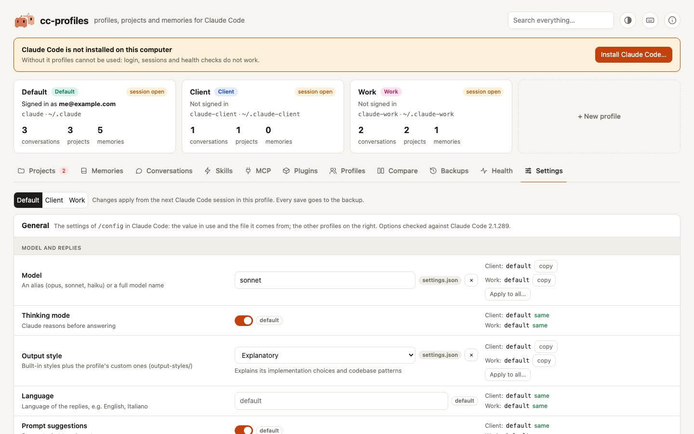

<h1 align="center">
  <br>
  <a href="https://github.com/andreaiannarone/cc-profiles">
    <picture>
      <source media="(prefers-color-scheme: dark)" srcset="docs/assets/logo-dark.svg">
      <source media="(prefers-color-scheme: light)" srcset="docs/assets/logo-light.svg">
      
    </picture>
  </a>
</h1>

<h4 align="center">A local web UI to manage multiple <a href="https://code.claude.com" target="_blank">Claude Code</a> profiles on one machine.</h4>

<p align="center">
  <a href="LICENSE"></a>
  <a href="CHANGELOG.md"></a>
  
  <a href="https://buymeacoffee.com/andreaiannarone"></a>
</p>

<p align="center">
  
  
  
  
  
  
  
  
</p>

<br>

<p align="center">
  <picture>
    <source media="(prefers-color-scheme: dark)" srcset="docs/assets/demo-dark.gif">
    <source media="(prefers-color-scheme: light)" srcset="docs/assets/demo-light.gif">
    
  </picture>
</p>

<p align="center">
  <a href="#quick-start">Quick Start</a> •
  <a href="#key-features">Features</a> •
  <a href="#screenshots">Screenshots</a> •
  <a href="#how-it-works">How It Works</a> •
  <a href="#usage">Usage</a> •
  <a href="#documentation">Documentation</a> •
  <a href="#configuration">Configuration</a> •
  <a href="#troubleshooting">Troubleshooting</a> •
  <a href="#license">License</a>
</p>

<p align="center">
  cc-profiles keeps your Claude Code profiles in order: work and personal accounts side by side, each with its own memory, conversations, skills, MCP servers and settings. Move projects and memories between profiles, relink projects whose folder moved, share skills and plugins, and edit settings with safe dropdowns, all from a page in your browser. Every change is backed up first, so anything you do can be undone with one click.
</p>

---

## Quick Start

Install with a single command:

```bash
curl -fsSL https://raw.githubusercontent.com/andreaiannarone/cc-profiles/main/install.sh | sh
```

The script installs cc-profiles with `pipx` or `uv`, whichever you have, and adds a `/cc-profiles` command to Claude Code in every profile. It never uses `sudo` and writes only in your home folder; [read it](install.sh) first if you like. Run it again to update. To install the app without touching your profiles:

```bash
curl -fsSL https://raw.githubusercontent.com/andreaiannarone/cc-profiles/main/install.sh | sh -s -- --no-command
```

Then open it, from a terminal or from inside Claude Code:

```bash
cc-profiles          # starts on http://127.0.0.1:4777 and opens your browser
```

```
/cc-profiles         # inside any Claude Code session: opens the app and the session goes on
```

On the first run, cc-profiles finds `~/.claude` and every `~/.claude-<name>` folder that looks like a profile. Rename them from the **Profiles** tab.

<details>
<summary><b>Other ways to install</b></summary>

By hand, with pipx or uv:

```bash
pipx install git+https://github.com/andreaiannarone/cc-profiles.git    # or: uv tool install git+…
cc-profiles install-command     # optional: adds /cc-profiles to Claude Code
```

Try it without installing anything:

```bash
uvx --from git+https://github.com/andreaiannarone/cc-profiles.git cc-profiles
```

From the Claude Code plugin marketplace. The command is then `/cc-profiles:open`, because Claude Code prefixes plugin commands with the plugin's name. The plugin only opens the app, so install cc-profiles first:

```
/plugin marketplace add andreaiannarone/cc-profiles
/plugin install cc-profiles@cc-profiles
```

From source:

```bash
git clone https://github.com/andreaiannarone/cc-profiles.git
cd cc-profiles
python3 -m pip install -e .
cc-profiles
```

</details>

> **Unofficial.** cc-profiles is a community project, not affiliated with or endorsed by Anthropic. It works with Claude Code's on-disk files, whose format is undocumented and may change between releases. That is why every operation it performs creates a backup you can restore with one click.

### Key Features

- 🗂️ **Projects**: see which profile each project belongs to and what it holds in each one. Move a project to another profile with its conversations, memories, file snapshots, prompt history and per-project settings. Relink a project whose folder you moved or renamed. Assign projects with simple path rules.
- 🧠 **Memories**: browse, edit, move and delete the memories of every project, with the `MEMORY.md` indexes kept in sync.
- 👤 **Profiles**: see the account each profile is signed in with. Create a profile, empty or copied from another one; rename it, change its command, or delete it, optionally merging its content into another profile first.
- 🧩 **Skills**: browse, create, edit, copy and delete the skills of each profile.
- 🔌 **MCP servers**: add, edit, copy and remove MCP servers, for every project or for one. Tokens in environment variables and headers stay out of the list.
- 🔗 **Sharing**: share `skills`, `plugins`, `agents`, `commands`, `CLAUDE.md` or `settings.json` with the source profile through symlinks. Install once, use everywhere.
- ⚙️ **Settings**: model, effort, output style, theme and more, with dropdowns that offer only the values Claude Code accepts and show which file each value comes from. Edit `CLAUDE.md`, permissions and the raw JSON, with validation.
- ⏪ **Backups**: every operation is journaled. **Restore** undoes it, and a restore can itself be undone.
- 🩺 **Health**: login status, config validity, broken links, memory indexes, and projects whose folder disappeared, with candidate folders to relink them to.
- ⌨️ **Inside Claude Code**: `/cc-profiles` opens the app from any session; `cc-profiles label` shows the active profile in your status line.
- 🌓 **Light and dark**: the theme button next to (i) picks System, Light or Dark; System follows your operating system.
- 🔒 **Local and private**: listens on `127.0.0.1` only, with a token on every request. Nothing is ever sent anywhere.

---

## Screenshots

<table>
  <tr>
    <td width="50%" valign="top">
      <picture>
        <source media="(prefers-color-scheme: dark)" srcset="docs/assets/screenshots/memories-dark.jpg">
        <source media="(prefers-color-scheme: light)" srcset="docs/assets/screenshots/memories-light.jpg">
        
      </picture>
      <p align="center"><b>Memories</b>: every project's memories, with an editor</p>
    </td>
    <td width="50%" valign="top">
      <picture>
        <source media="(prefers-color-scheme: dark)" srcset="docs/assets/screenshots/skills-dark.jpg">
        <source media="(prefers-color-scheme: light)" srcset="docs/assets/screenshots/skills-light.jpg">
        
      </picture>
      <p align="center"><b>Skills</b>: browse, create, edit and copy skills</p>
    </td>
  </tr>
  <tr>
    <td width="50%" valign="top">
      <picture>
        <source media="(prefers-color-scheme: dark)" srcset="docs/assets/screenshots/mcp-dark.jpg">
        <source media="(prefers-color-scheme: light)" srcset="docs/assets/screenshots/mcp-light.jpg">
        
      </picture>
      <p align="center"><b>MCP</b>: servers for every project or for one</p>
    </td>
    <td width="50%" valign="top">
      <picture>
        <source media="(prefers-color-scheme: dark)" srcset="docs/assets/screenshots/settings-dark.jpg">
        <source media="(prefers-color-scheme: light)" srcset="docs/assets/screenshots/settings-light.jpg">
        
      </picture>
      <p align="center"><b>Settings</b>: safe dropdowns, compared across profiles</p>
    </td>
  </tr>
</table>

The screenshots show sample data from the [/sandbox skill](.claude/skills/sandbox/SKILL.md). GitHub shows them in your theme, light or dark.

---

## Why

Claude Code reads its configuration from `~/.claude`, or from whatever directory `CLAUDE_CONFIG_DIR` points to. Each directory is a separate **profile** with its own memory, conversations, prompt history, settings and login:

```bash
claude                                     # default profile (~/.claude)
CLAUDE_CONFIG_DIR=~/.claude-work claude    # a second profile
```

That is great for keeping contexts apart, but maintaining profiles by hand is painful:

- Conversations live in folders named like `-Users-you-code-client--api`, one per project path.
- The prompt history is one JSONL file to filter line by line.
- The default profile's settings live in `~/.claude.json`, *outside* `~/.claude`.
- When you move a project folder, Claude Code silently loses its history.

cc-profiles does all of this for you, from a page in your browser.

---

## How It Works

**Core components:**

1. **Local server**: one Python file, standard library only. It listens on `127.0.0.1`, checks the `Host` header against DNS rebinding and a random token against requests from other websites.
2. **Single-page UI**: one HTML file with inline CSS and vanilla JavaScript, no build step and nothing loaded from the internet. Light and dark themes follow your system.
3. **Backups with a journal**: before any change, the files it touches are copied to `~/.cc-profiles/backups/<date>_<operation>/`, and every step (copy, move, new folder, new link) is written to a `manifest.json`. **Restore** replays the journal backwards.
4. **Atomic writes**: every file is written to a temporary file in the same folder and then renamed, so a running Claude Code never reads a half-written file. Writes follow symlinks, so shared files stay shared.
5. **Path recovery**: Claude Code's project folder names cannot be turned back into paths. cc-profiles rebuilds them from config files, prompt history and the `cwd` of conversations, and walks the disk when nothing mentions them.
6. **Launchers and commands**: new profiles get a small `claude-<id>` script in `~/.local/bin`; `cc-profiles install-command` adds `/cc-profiles` to Claude Code. Files cc-profiles creates carry a mark, and it never overwrites a file without it.

See [Architecture](docs/architecture.md) and [Claude Code's on-disk formats](docs/claude-code-formats.md) for details.

---

## Usage

```bash
cc-profiles                   # starts on http://127.0.0.1:4777 and opens the browser; ctrl+C stops it
cc-profiles --port 4800       # another port
cc-profiles --no-browser      # just the server
cc-profiles open              # starts it in the background if needed, opens the browser and returns
cc-profiles install-command   # adds the /cc-profiles command to Claude Code in every profile
cc-profiles label             # prints the name of the active profile, for status lines
```

### Open it from Claude Code

Type `/cc-profiles` in any Claude Code session: the app starts in the background, your browser opens on it, and the session goes on. The command is a small file, `commands/cc-profiles.md`, that `cc-profiles install-command` writes in every profile. Profiles that share `commands` with the source profile get it through the link.

### Commands for each profile

When cc-profiles creates a profile, it adds a launcher to `~/.local/bin`. For a profile called `work` that is `claude-work`:

```bash
#!/bin/sh
CLAUDE_CONFIG_DIR="$HOME/.claude-work" exec claude "$@"
```

The script works in every shell. Make sure `~/.local/bin` is in your `PATH`; the official Claude Code installer usually adds it.

### Show the profile in your status line

`cc-profiles label` prints the name of the profile in use, based on `CLAUDE_CONFIG_DIR`. Call it from your [Claude Code status line](https://code.claude.com/docs/en/statusline) script:

```bash
profile=$(cc-profiles label 2>/dev/null)
printf '(%s) ' "$profile"
```

### Rules

The **Projects** tab assigns each project to a profile using rules: "a path containing this text belongs to that profile". Create them from the UI with **Assign…**. They are checked in order, the first match wins and new rules go first:

```json
{ "match": "code/work", "profile": "work" }
```

`"profile": "shared"` marks paths that may appear in every profile, like your home folder.

---

## Documentation

📚 **[Full documentation](docs/README.md)**

### Getting Started

- **[Getting started](docs/getting-started.md)**: install, first run, launcher commands, `/cc-profiles`
- **[Concepts](docs/concepts.md)**: profiles, the source profile, projects, rules, sharing, backups

### Guides by Tab

- **[Projects](docs/guides/projects.md)**: move, relink, assign
- **[Memories](docs/guides/memories.md)**: browse, edit, move
- **[Profiles and sharing](docs/guides/profiles.md)**: create, edit, delete, share
- **[Skills and MCP servers](docs/guides/skills-and-mcp.md)**: create, edit, copy, delete
- **[Settings](docs/guides/settings.md)**: general settings, `CLAUDE.md`, permissions, raw JSON
- **[Backups](docs/guides/backups.md)**: what gets saved and how restoring works
- **[Health and About](docs/guides/health.md)**: checks, orphan projects, installing Claude Code

### Reference

- **[Configuration](docs/configuration.md)**: `config.json`, command line, environment variables
- **[Status line](docs/status-line.md)**: show the active profile in Claude Code
- **[Troubleshooting](docs/troubleshooting.md)**: common problems and their fixes

### For Contributors

- **[Architecture](docs/architecture.md)**: how the code is organized and why
- **[Claude Code's on-disk formats](docs/claude-code-formats.md)**: what the app reads and writes
- **[HTTP API](docs/api.md)**: every endpoint the UI uses
- **[Contributing](CONTRIBUTING.md)** and **[design system](DESIGN.md)**

---

## Configuration

cc-profiles keeps its own data in `~/.cc-profiles/`, never in the repository:

| Path | Content |
|---|---|
| `~/.cc-profiles/config.json` | profiles, rules, folders to search when relinking |
| `~/.cc-profiles/backups/` | one folder per operation: a `manifest.json` journal plus the original files |
| `~/.cc-profiles/server.log` | output of the server started by `cc-profiles open` |
| `~/.local/bin/claude-<id>` | launchers created for new profiles |
| `<profile>/commands/cc-profiles.md` | the `/cc-profiles` command, if you added it |

| Environment variable | Effect |
|---|---|
| `CC_PROFILES_PORT` | default port instead of 4777 |
| `CC_PROFILES_HOME` | data folder instead of `~/.cc-profiles` |
| `CC_PROFILES_QUIET` | if set, do not log HTTP requests to the terminal |

See the **[Configuration reference](docs/configuration.md)** for `config.json` and every option.

---

## System Requirements

- **macOS or Linux** (Windows is not supported yet)
- **Python 3.9 or later**: macOS's built-in Python works
- **pipx or uv** to install it
- **[Claude Code](https://code.claude.com/docs/en/setup)**, or let cc-profiles install it for you with the official installer

No dependencies: cc-profiles uses only the Python standard library.

---

## Security

- The server listens on `127.0.0.1` only and accepts only `Host: 127.0.0.1:<port>` or `localhost:<port>`, which blocks DNS rebinding.
- Every API call needs a random token, generated at each start and embedded in the page, so other websites cannot control the app.
- Writes are atomic (temporary file, then rename), so Claude Code never reads a half-written file, even while it is running.
- Names of projects, memories, skills and backups are validated against path traversal.
- Login credentials are never copied between profiles: each profile signs in on its own. Copying an MCP server copies its configuration, never its sign-in.
- The only network access is the optional Claude Code installer, which runs only if you click **Install**.

See [SECURITY.md](SECURITY.md) to report a vulnerability.

---

## Limitations

- Claude Code's file formats are not a public API. Settings dropdowns were checked against Claude Code 2.1.287; the **About** panel shows which version you have.
- The "session open" warning is a heuristic: a conversation written in the last 2 minutes.
- Claude Code keeps `.claude.json` in memory while it runs: restart open sessions after changing their MCP servers.
- Deleting a profile does not remove credentials that Claude Code may have stored in the macOS Keychain for it.

---

## Troubleshooting

| Problem | Fix |
|---|---|
| "Port 4777 is busy" | cc-profiles is already running: open the URL, or start it with `--port 4800` |
| A tab says the page is newer than the server | you updated cc-profiles while it was running: stop it and start it again |
| `cc-profiles: command not found` | run `pipx ensurepath` (or `uv tool update-shell`) and open a new terminal |
| `/cc-profiles` does not appear in Claude Code | run `cc-profiles install-command`, then restart the session |
| A project shows "folder not found on disk" | click **Relink…** and pick the folder where it lives now |
| A setting has no effect | the **Settings** tab shows which file the value comes from: `settings.local.json` wins over `settings.json` |

See the **[Troubleshooting guide](docs/troubleshooting.md)** for more.

---

## Contributing

Contributions are welcome! Please:

1. Fork the repository and create a branch
2. Make your changes with tests: every operation that writes must go through `Backup` and have a test that restores it
3. Keep it standard library only and compatible with Python 3.9
4. Update the documentation and `CHANGELOG.md`
5. Open a pull request

See [CONTRIBUTING.md](CONTRIBUTING.md) to run the app and the tests locally. If you use Claude Code, the repository's `.claude/` folder keeps you on a sandbox and has skills for the common chores. Good first contributions: translations (the UI is English only), Windows support, a "dry run" preview for big operations.

---

## License

cc-profiles is licensed under the **[GNU General Public License v3.0 or later](LICENSE)**. © Andrea Iannarone

You can use, study, change and share it freely. If you distribute it, modified or not, you must do so under the same license and with the source code. Version 0.1.0 was released under MIT and stays available under it.

---

## Support

- **Documentation**: [docs/](docs/README.md)
- **Issues**: [GitHub Issues](https://github.com/andreaiannarone/cc-profiles/issues)
- **Repository**: [github.com/andreaiannarone/cc-profiles](https://github.com/andreaiannarone/cc-profiles)
- **Buy me a coffee**: [buymeacoffee.com/andreaiannarone](https://buymeacoffee.com/andreaiannarone)
- **Author**: Andrea Iannarone ([@andreaiannarone](https://github.com/andreaiannarone))

---

<p align="center"><b>Built with Claude Code</b> | <b>Made for Claude Code</b> | <b>Pure Python standard library</b></p>
