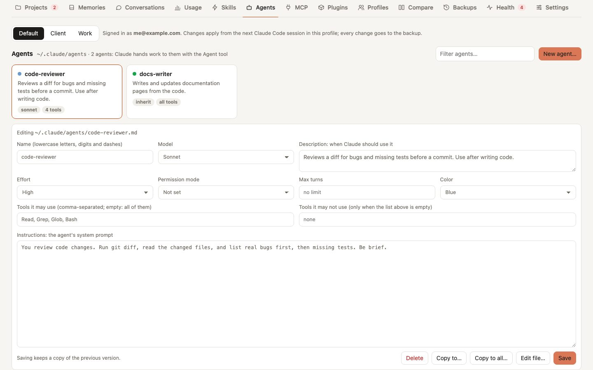

# Agents

The **Agents** tab manages the subagents of one profile at a time: the files in its `agents/` folder. Claude hands work to a subagent with the Agent tool when the subagent's description fits the task, and the subagent runs with its own instructions, model and tools. Pick the profile at the top of the tab, as in Skills and MCP.

<picture>
  <source media="(prefers-color-scheme: dark)" srcset="../assets/screenshots/agents-dark.jpg">
  
</picture>

Every change goes to a backup first, like any other operation, and applies from the next Claude Code session in that profile.

## The list

Each card shows the agent's name, with its color, its description, the model, how many tools it may use (*all tools* when the list is empty), **linked** when the file is a link to somewhere else, and **invalid** when Claude Code skips it because the file has no frontmatter or no description. Type in *Filter agents…* to narrow the list.

Agents that installed plugins bring are listed below, under **From plugins**, read-only: the plugin installs and updates them.

## Create or edit an agent

**New agent…** opens an empty form; a click on a card opens that agent in it. The fields are the ones Claude Code reads from the agent's frontmatter, checked against the version in the form's header (Claude Code 2.1.294):

| Field | In the file | What it does |
|---|---|---|
| Name | `name` | how Claude and `claude --agent` call it; also the file name, `agents/<name>.md`. Lowercase letters, digits and dashes. Changing it renames the file |
| Description | `description` | when Claude should use it. Required: Claude reads it to pick the agent, so say what it does and when |
| Model | `model` | `inherit` (the conversation's model), `sonnet`, `opus`, `haiku` or `fable`; not set also means inherit |
| Effort | `effort` | thinking effort: low, medium, high or max |
| Permission mode | `permissionMode` | how its tool calls are approved, as in Settings: ask, plan, accept edits, auto, don't ask, bypass |
| Max turns | `maxTurns` | how many turns it may take before it stops; empty for no limit |
| Color | `color` | its color in Claude Code |
| Tools it may use | `tools` | comma-separated, e.g. `Read, Grep, Glob, Bash`; empty for every tool. Suggestions appear as you type |
| Tools it may not use | `disallowedTools` | removed from the full set; Claude Code ignores it when the list above is set |
| Instructions | the text after the frontmatter | the agent's system prompt |

Other keys of the file, such as `hooks`, `mcpServers`, `skills` or `memory`, are not in the form: the editor's header lists them, and **Save** keeps them exactly as they were. **Edit file…** opens the whole file to change anything; it checks that the frontmatter is still there, that `name` has not changed (rename from the form) and that there is a description.

**Save** keeps the previous version in the backup. A dropdown always keeps a value the file already has, even one the list does not know.

## Copy and delete

- **Copy to…**: copies the file, as it is saved, to another profile. It is refused if that profile already has an agent with the same name, or if the two profiles [share](profiles.md#share-items) their agents.
- **Copy to all…**: copies it to every profile that does not have an agent with that name. The confirmation lists the profiles that get it and the ones skipped, with the reason. One backup covers every profile.
- **Delete**: moves the file to the backup. For a linked agent only the link is removed.

If the profile shares `agents` with others, the header says so: a change applies to all of them. **Compare** lists the agents that only one of two profiles has, with a button to copy them, and the ones whose files differ.

Agents of a single project live in that project's `.claude/agents/` folder, which belongs to the project: they are not shown here.
