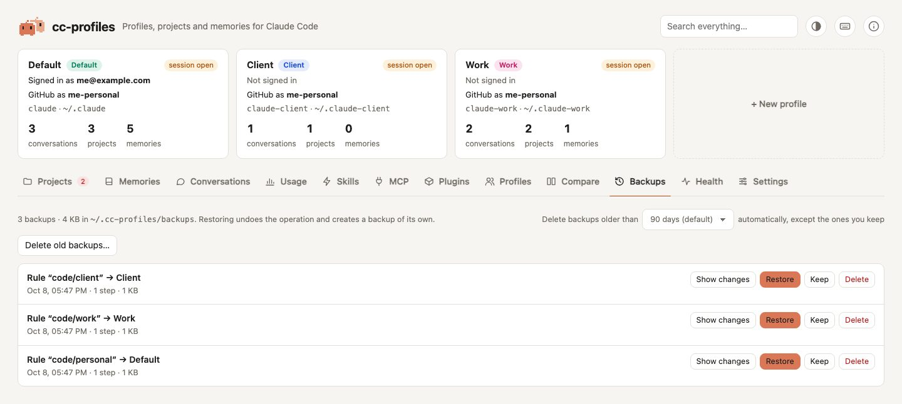

# Backups

Every operation that changes files creates a backup in `~/.cc-profiles/backups/<date>_<operation>/`, before touching anything.

<picture>
  <source media="(prefers-color-scheme: dark)" srcset="../assets/screenshots/backups-dark.jpg">
  
</picture>

## What a backup contains

| File | Content |
|---|---|
| `manifest.json` | title, time, cc-profiles version, log lines, and the **journal** |
| `operation.txt` | the same title and log, readable without tools |
| `file/` | original copies of modified files, and anything moved out of the way |

The journal lists every step in order:

| Step | Meaning | Restoring does |
|---|---|---|
| `copy` | a file was modified; its original is in `file/` | puts the original back |
| `absent` | a file was created that did not exist | removes it |
| `stash` | a file or folder was moved out of the way, into `file/` | moves it back |
| `move` | something was moved from `from` to `to` | moves it back to `from` |
| `mkdir` | a folder was created | removes it if still empty |
| `created` | a link, launcher or profile was created | removes it |

Only the first copy of a file is kept, because it is the state before the operation. Modified files are stored through symlinks, so restoring a shared file writes the real file and keeps the link.

## Show changes

**Show changes**, next to Restore, opens a read-only panel with what the operation did, in plain words: every file copied before a change, every file that did not exist before, every item moved (from → to), every folder or link created and everything moved to the backup instead of being deleted.

For each file copied before a change it shows a diff between the copy in the backup (lines starting with `-`) and the file **as it is now** (`+`). That is what Restore would undo; if the file changed again after the operation, the diff includes those later changes too, and a note says so. Other notes say when the file no longer exists, is not a text file, or is too big to compare (over 512 KB). A long diff stops after 2,000 lines.

JSON files are compared with their keys sorted, so a different key order is not a change. Secrets are never shown: `.credentials.json` is not opened at all, and in JSON files the values under `env` and `headers` (as in the MCP tab), keys that look like secrets (`token`, `apiKey`, `password`, `Authorization`, …) and values that look like a token (`sk-…`, `ghp_…`, `Bearer …`) are replaced by `•••• hidden`.

## Incomplete backups

If an operation fails halfway (a disk error, a file Claude Code locked, a bug), the steps it had already done stay journaled: the backup is closed anyway and labelled **incomplete**, and the error message says so. **Restore** undoes those steps like any other backup. A failure before any change leaves no backup.

## Restore

**Restore** walks the journal backwards. It is itself an operation with a backup (titled *Before restoring: …*), so you can undo a restore.

A step that cannot be replayed is skipped and reported, for example when something it needs was moved again since. The other steps still run.

**Restore newest first.** Operations often depend on each other: if B moved a file that A created, A cannot be undone cleanly while B is still in place. When you restore an older backup while newer ones are still active, the app warns you.

A backup can be restored once; afterwards it shows *restored* with the time.

## Delete

**Keep** marks a backup that no cleanup may delete, automatic or by hand; press it again (**Kept ✓**) to let it go. A kept backup shows a *kept* label and cannot be deleted until you turn Keep off. The mark is stored in the backup's own `manifest.json`.

**Delete** erases a backup folder for good. It is the only action in cc-profiles that really deletes data. Backups take space, especially after deleting or merging whole profiles; the tab shows the total size.

**Delete old backups…** removes in one go every backup older than 7, 30, 90 or 365 days, except kept ones, and shows how many and how much space before you confirm.

## Automatic cleanup

**Delete backups older than … automatically**, in the toolbar of the Backups tab, is always on: 90 days by default, or 15, 30 or 60. cc-profiles deletes the backups older than that when it starts and once a day while it runs. Changing it asks first and shows what goes right away.

The automatic cleanup never deletes:

- a backup you marked **Keep**;
- a backup of an operation done in the last 24 hours;
- an [incomplete backup](#incomplete-backups) that has not been restored yet, because it may hold the only way to undo a failed operation.

The setting is stored as `backup_keep_days` in [`config.json`](../configuration.md). Changing it is an operation with its own backup, like any other. The backups it deletes cannot be restored.

## Without the UI

Backups are plain files. If the app cannot start, you can still read `operation.txt` and copy files back from `file/` by hand, using the journal in `manifest.json` as a map.
