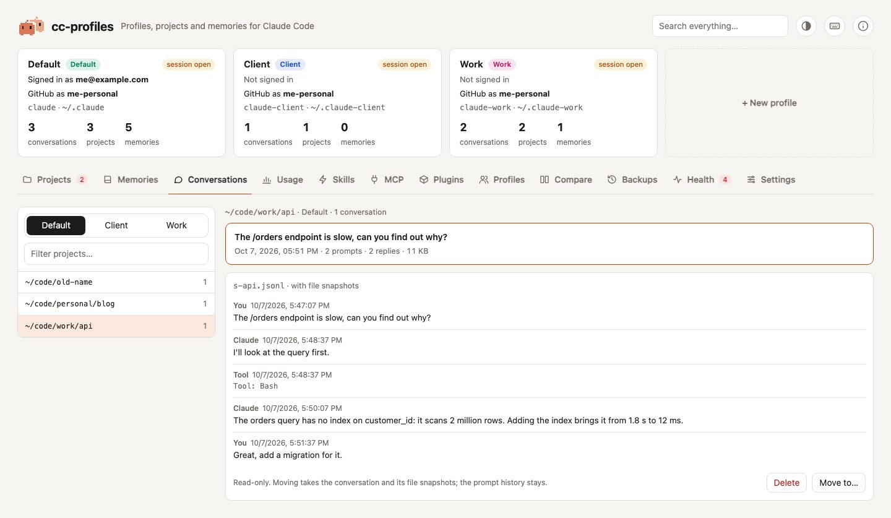

# Conversations

The **Conversations** tab shows the conversations Claude Code saved for each project, and moves or deletes them one at a time. To move a whole project, with its memories, prompt history and settings, use the [Projects](projects.md) tab instead.

<picture>
  <source media="(prefers-color-scheme: dark)" srcset="../assets/screenshots/conversations-dark.jpg">
  
</picture>

## Browse

Pick a profile and a project on the left: only projects with at least one conversation are listed, with how many they have. Each conversation shows:

- its **title**: the one Claude Code generated, or else the first prompt you typed;
- the date of its last message, how many prompts you typed and how many replies Claude wrote, and the size of the file.

Slash commands, tool results and other bookkeeping lines are not counted as prompts.

## Read

Click a conversation to read it below the list: your prompts, Claude's replies and, in grey, one line for each tool Claude used (`Tool: Bash`). Tool results and Claude's thinking are left out. Very long conversations show their last 300 messages, and very long messages are cut; the viewer says so when it happens. The viewer is read-only.

## Move to another profile

**Move to…** moves one conversation to the same project in another profile:

| What | Where it lives |
|---|---|
| the conversation | `projects/<name>/<session>.jsonl` |
| its file snapshots, if any | `file-history/<session>/` |

The prompt history (`history.jsonl`), the project's memories and its settings stay where they are. Moving is refused when the other profile already has a conversation with the same id.

## Delete

**Delete** moves the conversation and its file snapshots to the backup: restore it from the [Backups](backups.md) tab.

## Example: a conversation started in the wrong profile

You opened `claude` in `~/code/work/api` but forgot that the terminal was in your personal profile. The conversation is useful and you want to resume it from Work.

1. Close that Claude Code session.
2. In the **Conversations** tab, pick the personal profile and the `~/code/work/api` project.
3. Find the conversation by its title or date, and click **Move to…** → *Work*.
4. In the project folder, run `claude-work --resume`: the conversation is in the list.

The prompts you typed stay in the personal profile's arrow-up history. To move everything the project has in that profile, use [Move a project](../how-to/move-a-project.md) instead.

## Open sessions

If Claude Code is running in the profile, the confirmation says so: if that session is the conversation you are moving or deleting, it keeps writing to it. Close it first.
