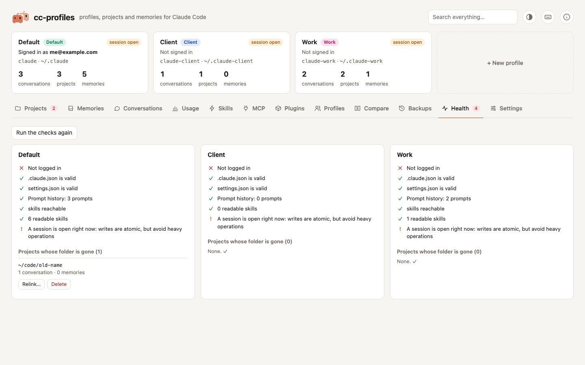

# Health and About

## Health

<picture>
  <source media="(prefers-color-scheme: dark)" srcset="../assets/screenshots/health-dark.jpg">
  
</picture>

The **Health** tab checks every profile:

| Check | Fails when |
|---|---|
| Login | `claude auth status` says the profile is not logged in |
| `.claude.json`, `settings.json`, `settings.local.json` | the file is not valid JSON |
| Prompt history | some lines of `history.jsonl` are not valid JSON |
| `skills`, `plugins` | the folder is a broken link (shared items show where they point) |
| Plugins | an installed plugin's files are missing |
| Memory indexes | `MEMORY.md` lists a missing file (error), or a memory is not listed (warning) |
| Open session | warning only: a `claude` process is running in the profile, or one of its conversations was written in the last 2 minutes |

Below the checks, **Projects whose folder is gone** lists the [orphan projects](projects.md#orphan-projects) of the profile, with one-click **Relink to …** buttons for the candidate folders found, plus **Relink…** and **Delete**.

Health runs `claude auth status` once per profile, so it takes a few seconds. **Run the checks again** refreshes it.

## About

The ⓘ button at the top right opens a panel with:

- **Claude Code**: version, binary path, install method, auto-updates, and the Claude Code version the settings dropdowns were checked against.
- **Each profile**:
  - account, login method, plan, organization, API provider;
  - usage: startups, first start, conversations, projects, memories, prompts, disk usage;
  - contents: skills, plugins, subagents, slash commands, output styles, MCP servers, hooks, `CLAUDE.md`, shared items.
- **cc-profiles**: version, code and data locations, number and size of backups, address, Python version.

## Updating cc-profiles

At the bottom of the About panel, **Check for updates** asks PyPI for the latest version of cc-profiles. It runs only when you click: this and the Claude Code installer are the only times cc-profiles reaches the internet, and PyPI sees your IP address.

When a newer version exists, **Update to …** runs the update for the way you installed cc-profiles, `pipx upgrade cc-profiles` or `uv tool upgrade cc-profiles`, then restarts the app on the same port; the page reloads by itself. Your profiles, backups and settings are not touched. A copy run from the source folder, or installed with plain pip, shows the command to run by hand instead. In the first minutes after a release, PyPI announces the new version before pip can download it: the update then changes nothing, says so, and offers **Try again** (pip's output is under *Details*). After updating from a terminal, run `cc-profiles restart` so the running app picks up the new version.

## Installing Claude Code

If Claude Code is not found, a notice at the top of the page offers **Install Claude Code…**. The same button is in the About panel. You pick one of the official methods from the [Claude Code setup guide](https://code.claude.com/docs/en/setup):

| Method | Command | Updates |
|---|---|---|
| Official installer (recommended) | `curl -fsSL https://claude.ai/install.sh \| bash` | automatic |
| Homebrew, stable | `brew install --cask claude-code` | `brew upgrade claude-code` |
| Homebrew, latest | `brew install --cask claude-code@latest` | `brew upgrade claude-code@latest` |
| npm (Node.js 22+) | `npm install -g @anthropic-ai/claude-code` | `npm install -g @anthropic-ai/claude-code@latest` |

Methods that cannot work on your machine are disabled, with the reason ("Homebrew is not installed", "needs Node.js 22 or later"). The installation output is shown live, and at the end the app checks that `claude` is really there.

If Claude Code is installed but your terminal cannot find it (usually because `~/.local/bin` is not in `PATH`), the notice tells you which line to add to your shell startup file.

cc-profiles looks for programs in your `PATH` plus `~/.local/bin`, `/opt/homebrew/bin` and `/usr/local/bin`, so it finds a fresh installation even if it was started from a terminal opened before installing.
