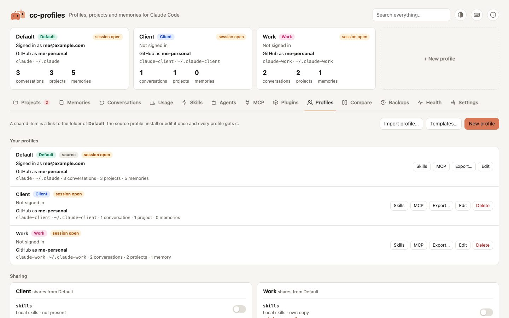

# Profiles and sharing

The **Profiles** tab lists your profiles with their command, folder and how many conversations, projects and memories each has. From here you create, edit and delete profiles, start one from a template, choose what each profile shares with the source profile, and turn on [profile by folder](profile-by-folder.md).

<picture>
  <source media="(prefers-color-scheme: dark)" srcset="../assets/screenshots/profiles-dark.jpg">
  
</picture>

## Create a profile

**New profile** (in the Profiles tab, or the **+ New profile** card at the top) asks for:

- **Name**: shown in the UI and the [status line](../status-line.md), for example *Work*.
- **Id**: lowercase letters, digits and dashes, for example `work`. It defines the folder `~/.claude-work` and the command `claude-work`.
- **Base**:
  - *Copy of …* copies settings, `CLAUDE.md`, skills, plugins, agents, MCP servers and per-project settings from an existing profile. Optionally it also copies conversations, history and project memories. General memories (your home project) are always copied.
  - *From template: …* starts from a [template](#templates): its settings, `CLAUDE.md`, permissions, skills, agents, commands, output styles and MCP servers, as the profile's own copies, except the items you share. No conversation comes along.
  - *Empty* starts from scratch, with only the status line setting of the source profile.
- **Share with the source profile**: which items become [links](../concepts.md#sharing) instead of copies. Skills and plugins are ticked by default; with a template only plugins are, so the template's own skills are used. You can change the choice later, under **Sharing**.

With a template, an item you share is linked to the source profile **instead of** being filled from the template: the template's copy of it is not used. The dialog lists what each shared item skips, for example *skills: shared with Default, the template's 3 skills are not copied*, and the confirmation after creating says the same. Templates never hold plugins, so sharing `plugins` is how a profile created from a template gets the plugins of the source profile.

What a new profile never gets:

- **login credentials** (`.credentials.json`) and account data (`oauthAccount`, `userID`): run the new command and use `/login`. A copied token could be invalidated when the original profile refreshes it.
- runtime state: caches, open sessions, telemetry.

cc-profiles also creates the launcher `~/.local/bin/claude-<id>` (see [Getting started](../getting-started.md#starting-claude-code-in-a-profile)) and adds the `/cc-profiles` command to the new profile, so you can open this app from it right away. If the profile shares `commands` with the source profile, the command goes into the source and reaches both through the link. A `cc-profiles.md` that cc-profiles did not write is left as it is.

Items you choose to share that the source profile does not have yet are created there, empty, so the link always works.

## Templates

A template is a reusable starting point for new profiles. **Templates…** in the Profiles tab lists them and saves a new one from any profile.

A template holds the profile's `settings.json` and `settings.local.json` (with permissions and hooks), `CLAUDE.md`, `skills/`, `agents/`, `commands/`, `output-styles/` and the MCP servers of `.claude.json` (user scope). It **never** holds conversations, prompt history, memories, plugins, login credentials (`.credentials.json`) or account data (`oauthAccount`, `userID`). Shared items are saved as real files, so the template does not depend on the source profile.

Templates are `.zip` files in `~/.cc-profiles/templates/`, in the same format as an [export](export-import.md) without conversations. Creating a profile from a template uses the import code, so paths inside `settings.local.json` point to the new folder.

Saving, deleting and creating a profile from a template each have a backup. A deleted template goes to the backup and Restore brings it back.

## Edit a profile

**Edit** changes:

- **Name**: updates the UI and the status line right away.
- **Command**: renames the launcher, or rewrites the alias if the profile was set up with a shell alias before. The source profile's command is `claude` and cannot change. A command that already exists as another program is refused.

The **folder never changes**: the profile's files store absolute paths to it, so renaming it would break them.

## Delete a profile

**Delete** offers two options:

- **Delete everything**: the whole folder goes to the backup.
- **First move conversations, memories and history to …**: every project with content is [moved](projects.md#move-a-project-to-another-profile) to another profile, together with the remaining prompt history, and then the folder goes to the backup.

In both cases the profile leaves `config.json` and its launcher (or shell alias) is removed. Type the profile's name to enable the button.

The dialog shows what the chosen option does before you confirm: how many projects, conversations, memories and prompts move and where, and under **Show the files and folders it touches** every item, including the launcher, the alias line in your shell file, the entry in `config.json` and the folder that goes to the backup. The preview changes nothing.

Deleting is refused:

- for the source profile, because the others share from it;
- while a session is open in the profile (a `claude` process is running in the profile, or one of its conversations was written in the last 2 minutes), because a running Claude Code would keep writing into a folder that is gone.

## Share items

Under **Sharing**, each secondary profile has a switch per item:

| Item | What sharing means |
|---|---|
| `skills` | same local skills everywhere |
| `plugins` | same installed plugin files (enabling is per profile, in `settings.json`) |
| `agents` | same custom subagents |
| `commands` | same custom slash commands |
| `CLAUDE.md` | same global instructions |
| `settings.json` | same settings, status line, enabled plugins, permissions and hooks |

Turning a switch **on** replaces the profile's own copy with a link. The old copy goes to the backup, and the confirmation lists anything the source profile does not have, so you can copy it over first. Turning it **off** gives the profile an independent copy of the current source content.

Both confirmations have **Show the files and folders it touches**: the own copy that goes to the backup, each item only that copy has, the link and its target, and what is created in the source profile when it does not have the item yet; when separating, the link that goes to the backup and the files copied in its place.

## A GitHub account per profile

Signing in to GitHub is not part of a Claude Code profile: the GitHub CLI (`gh`) keeps its sign-in in a folder, `~/.config/gh`, shared by everything you run. cc-profiles gives **every profile a GitHub CLI folder of its own**, named after it:

| Profile | GitHub CLI folder |
|---|---|
| Default (`~/.claude`) | `~/.config/gh`, the same as your terminal |
| `~/.claude-<id>` | `~/.config/gh-<id>` |

cc-profiles creates the missing folders when it starts, and a new profile gets its own right away. A new folder starts with the account the profile used until then (`config.yml` and `hosts.yml` are copied without any token line), and `GH_CONFIG_DIR` in the `env` of the profile's `settings.json` points to it: Claude Code passes it to every command it runs, so `gh` in that profile's sessions uses that folder. The profile cards and the About panel show the account: **GitHub as …**.

Under each profile in **Your profiles**, the line *GitHub CLI* shows its folder and every account signed in on this computer: the one in use is marked **connected**, the others have **Connect**, and **Another account…** signs in a new one. The **GitHub** section at the bottom of the tab has the same choices in a table, with the commit identity:

- **GitHub account**: pick any account signed in on this computer. It becomes the active account of that profile's folder only, without signing in again: `gh` keeps each account's token in the system keychain under its name. Picking an account for Default changes your terminal's too.
- **Another account…** (at the end of the menu) shows the command to sign in with a new account in the profile's folder, ready to copy:
  ```sh
  GH_CONFIG_DIR=~/.config/gh-work gh auth login
  ```
  Then click **I signed in, refresh**: from then on every profile can pick that account too.
- **Commit identity…** sets the name and email of the commits made in the profile (`GIT_AUTHOR_*` and `GIT_COMMITTER_*` in its `env`; both or neither), for example the `…@users.noreply.github.com` address of its account.

A profile whose `settings.json` is shared with the source profile also shares its GitHub account, so it has no folder. An account whose token is written in `hosts.yml` (`gh auth login --insecure-storage`) is not offered to the other profiles, because its token is not in the keychain; a folder copied from it asks for a sign-in.

For `git push` to follow the account too, git must ask `gh` for GitHub passwords: run `gh auth setup-git` once. The section warns when it is not set up, with a button to copy the command. Changes apply to the profile's Claude Code sessions, not to your own terminal (except for Default), and an open session picks them up when it restarts. Every change goes to the backup.

cc-profiles reads only which users each folder is signed in as, never a token. Deleting a profile leaves its GitHub CLI folder in place; `gh auth logout` inside one folder removes that account's token from the keychain, which signs it out in every folder.
