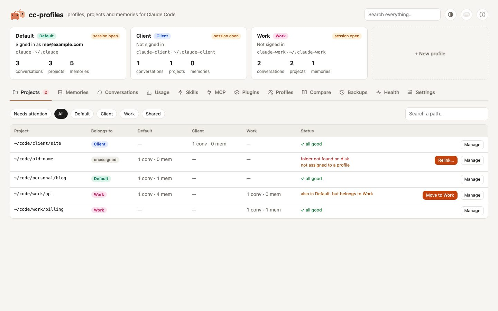

# Projects

The **Projects** tab lists every project that has a folder under `projects/` in at least one profile. For each one it shows:

- **Belongs to**: the profile the [rules](../concepts.md#rules) assign it to, *All profiles* for shared paths, or *unassigned*.
- One column per profile: how many conversations and memories the project has there.
- **Status**: what needs fixing, if anything.

The tab opens on **Needs attention**. Use the chips to see all projects, the projects of one profile, or the shared ones, and the search field to filter by path.

<picture>
  <source media="(prefers-color-scheme: dark)" srcset="../assets/screenshots/projects-dark.jpg">
  
</picture>

## Move a project to another profile

When a project has content in a profile it does not belong to, its row shows **Move to …**. You can also choose *Move from A to B* under **Manage**.

Moving takes everything that belongs to the project in the source profile:

| What | Where it lives |
|---|---|
| conversations | `projects/<name>/*.jsonl` |
| memories and their `MEMORY.md` index | `projects/<name>/memory/` |
| file snapshots of those conversations | `file-history/<session>/` |
| prompts typed in that project | `history.jsonl` |
| per-project settings (trust, allowed tools, MCP servers) | `projects` key of `.claude.json` |

Before confirming, *Show the files and folders it touches* lists every item and what happens to it: moved, merged into the target's `MEMORY.md`, or kept in the backup because the target already has it. The preview changes nothing.

If a Claude Code session is open in either profile, the confirmation says so: Claude Code keeps `.claude.json` in memory and could write the old project settings back. Close it first, or restart it after moving.

If the target profile already has something with the same name, the target's version is kept and the incoming one goes to the backup. Index lines of `MEMORY.md` are merged. Prompts already present in the target history (same text and timestamp) are not duplicated.

## Orphan projects

A project is an **orphan** when its folder no longer exists on disk, usually because you moved or renamed it. Claude Code then stops showing its history, because it looks for the folder under its new name.

**Relink…** asks where the project is now. It suggests folders with the same name, found by searching the folders in `search_roots` (your home by default) up to 5 levels deep, skipping `node_modules`, `Library`, hidden folders and build folders. Relinking:

1. moves the conversations and memories to the folder name that matches the new path;
2. rewrites the prompts in `history.jsonl` to the new path, so arrow-up history works there again;
3. renames the per-project settings in `.claude.json`.

If the folder is gone for good, **Delete** moves the project to the backup.

> A project on an external disk shows as an orphan while the disk is not connected. Leave it alone: it comes back when you plug the disk in.

## Assign projects with rules

**Assign…** (or *Assign to a profile* under **Manage**) creates a rule from a piece of the path, for example `code/work` → *Work*. Every current and future project whose path contains that text belongs to that profile. Prefer the shortest piece that is still unambiguous: a rule on a parent folder covers everything inside it.

## Delete a project from a profile

**Manage → Delete from …** moves the project's folder and its file snapshots to the backup. The project stays in the other profiles. Prompts in the history are left untouched: they disappear once the folder is gone, and they come back if you restore.
