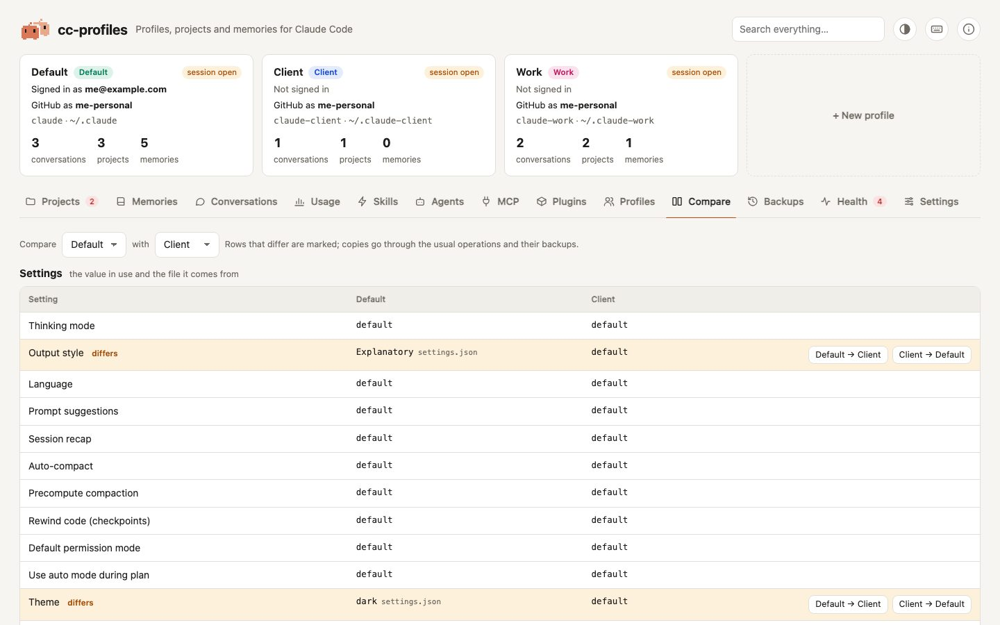

# Search and compare

Two read-only views that look across profiles: they never change anything by themselves.

<picture>
  <source media="(prefers-color-scheme: dark)" srcset="../assets/screenshots/compare-dark.jpg">
  
</picture>

## Search everything

The field at the top of the page, next to the theme button, searches every profile at once. Type at least two characters: results appear after a short pause, or right away with Enter.

Results are grouped by kind, each with the profile it belongs to and an excerpt with the match highlighted:

| Kind | What is searched | Clicking a result opens |
|---|---|---|
| Projects | the real path of the project | the **Projects** tab, filtered on that path |
| Memories | the name, description and text of each memory | the memory, in the **Memories** tab |
| Skills | the name and the whole `SKILL.md` | the skill, in the **Skills** tab |
| MCP servers | the name and the command or URL | the **MCP** tab of that profile |
| CLAUDE.md | each line of the profile's `CLAUDE.md` | the **Settings** tab of that profile |

A project, a skill or a `CLAUDE.md` that several profiles see (through sharing) shows up once, with every profile that has it. The search is case-insensitive, shows at most 30 results per kind and stops after a few seconds on very large profiles; the header says so when the list is partial. Values of MCP environment variables and headers are never searched or shown, because they often hold tokens.

Esc, **Close search** or an empty field go back to the tab you were on.

## Compare two profiles

The **Compare** tab puts two profiles side by side: pick them at the top. Rows that differ are marked *differs* or *only in …*.

- **Settings**: the value in use for each setting of the Settings tab, and the file it comes from. **A → B** copies a value into the other profile, like editing it in the Settings tab.
- **Permissions**: the `allow`, `ask` and `deny` rules of `settings.json` that only one profile has. **Add to …** adds the rule to the other profile and keeps its own rules.
- **Skills**: the skills only one profile has (**Copy to …** copies the whole folder) and the skills both have with a different `SKILL.md`, to edit in the Skills tab.
- **Agents**: the agents only one profile has (**Copy to …** copies the file) and the agents both have with a different file, to edit in the Agents tab.
- **MCP servers** available in every project: the servers only one profile has (**Copy to …** copies the configuration, never the sign-in) and the ones whose configuration differs.
- **CLAUDE.md**: whether the two files are the same, and how long they are. **Replace …** gives one profile the other's `CLAUDE.md`, after a confirmation.
- **Plugins**: installed and enabled plugins, read-only: manage them with `/plugin` in Claude Code.

Every copy goes through the same operation as in the other tabs, so it has its own backup and can be undone from the **Backups** tab.
