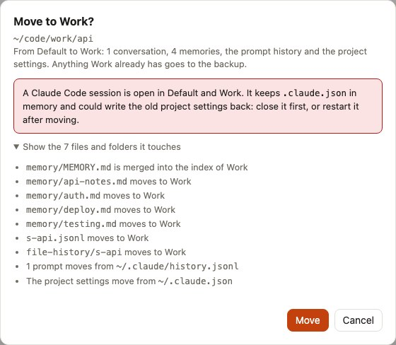

# Move a project to another profile

You started a project in the wrong profile, or it changed hands: from a client to your own work, from personal to work. Moving it takes its whole history along, so `/resume`, arrow-up history and memories keep working in the new profile.

## Before you start

Close the Claude Code sessions open in that project, in both profiles. Claude Code keeps `.claude.json` in memory and could write the old project settings back. The confirmation warns you when it finds an open session.

## Move it

1. Open the **Projects** tab and click **All**, or type part of the path in the search field.
2. On the project's row, click **Manage → Move from *A* to *B***. If a [rule](../concepts.md#rules) already says the project belongs to *B*, the row shows **Move to *B*** directly.
3. Click *Show the files and folders it touches* to see what happens to each item. The preview changes nothing.
4. Confirm.

<picture>
  <source media="(prefers-color-scheme: dark)" srcset="../assets/screenshots/move-dark.jpg">
  
</picture>

What moves:

| What | Where it lives |
|---|---|
| conversations | `projects/<name>/*.jsonl` |
| memories and their `MEMORY.md` index | `projects/<name>/memory/` |
| file snapshots of those conversations | `file-history/<session>/` |
| prompts typed in that project | `history.jsonl` |
| per-project settings (trust, allowed tools, MCP servers) | `projects` key of `.claude.json` |

When the target profile already has an item with the same name, its version stays and the incoming one goes to the backup. `MEMORY.md` lines are merged.

## Make it stick

Without a rule, the project shows up again under **Needs attention** the next time you use it from the other profile. Click **Assign…** on the row and give it the shortest piece of the path that identifies it, for example `code/acme` → *Client*. With [Profile by folder](../guides/profile-by-folder.md) on, `claude` then starts in the right profile there.

## Move less than a whole project

- **One conversation**: the **Conversations** tab, **Move to…**. It takes the conversation and its file snapshots; prompts, memories and settings stay. See [Conversations](../guides/conversations.md#move-to-another-profile).
- **One memory**: the **Memories** tab, **Move…**, to any project of any profile. See [Memories](../guides/memories.md#move).

## Undo

Open the **Backups** tab: the move is at the top, named after the project. **Show changes** lists every step, **Restore** puts everything back. See [Backups](../guides/backups.md).
