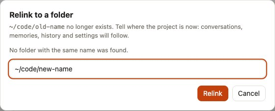

# Relink a project you moved

You renamed or moved a project folder, for example from `~/code/api` to `~/code/work/api`, and now Claude Code acts as if it had never seen it: `/resume` lists nothing, arrow up shows no prompts, the memories are gone.

Nothing is lost. Claude Code stores a project's history in a folder named after its path (see [Concepts](../concepts.md#projects)), so after a move it looks under the new name and finds nothing. Relinking renames that history to match the new path.

## 1. Find the orphan project

Open the **Projects** tab. The project is under **Needs attention**, with its old path and the status *folder not found on disk*. The **Health** tab lists the same projects per profile, under *Projects whose folder is gone*.

## 2. Relink it

Click **Relink…**. cc-profiles suggests folders with the same name, found by searching your home folder up to 5 levels deep. Pick the right one, or type the new path, and confirm.

<picture>
  <source media="(prefers-color-scheme: dark)" srcset="../assets/screenshots/relink-dark.jpg">
  
</picture>

Relinking works on one profile at a time. If the project has history in more than one profile, relink it in each: the **Health** tab lists it under every profile concerned. In that profile, relinking:

1. moves the conversations and memories to the folder name that matches the new path;
2. rewrites the prompts in `history.jsonl` to the new path, so arrow-up history works there again;
3. renames the per-project settings in `.claude.json` (trust, allowed tools, MCP servers).

Start `claude` in the new folder: `/resume` shows the old conversations again.

## When the folder is not suggested

The search skips `node_modules`, `Library`, hidden folders and build folders, and looks only under the folders in `search_roots`. If your code lives on another disk, add it there: see [Configuration](../configuration.md#search_roots). Typing the path by hand always works.

## When not to relink

- **The folder is on an external disk** that is not connected: the project looks orphaned until you plug the disk back in. Leave it alone.
- **The folder is gone for good**: **Delete** moves the project to the backup instead.

Relinking has a backup like every other change: **Restore** in the **Backups** tab undoes it.
