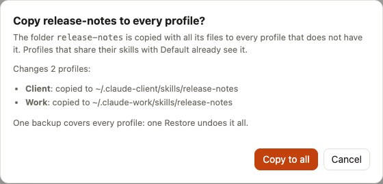

# Use the same skills in every profile

You wrote a skill in one profile and want it in the others, or you want every profile to always have the same set. There are two ways, and they suit different needs.

| | Share the `skills` folder | Copy a skill |
|---|---|---|
| What happens | the profile's `skills/` becomes a link to the source profile's | the skill's folder is copied |
| Later edits | reach every sharing profile at once | stay in the profile you edit |
| Good for | one personal set used everywhere | one skill, or profiles that must stay different |

## Share the whole folder

1. Open the **Profiles** tab and find **Sharing**.
2. Turn on **skills** for the profile.
3. The confirmation lists the skills that only this profile has: they go to the backup when the link replaces its folder. To keep them, first copy them to the source profile (next section), then turn the switch on.

From then on, a skill created or edited in either profile is there for both. Turning the switch off gives the profile its own copy of the current skills. See [Profiles and sharing](../guides/profiles.md#share-items).

## Copy one skill

1. Open the **Skills** tab and pick the profile that has the skill.
2. Click the skill, then **Copy to…** for one profile, or **Copy to all…** for every profile that does not have it yet.

<picture>
  <source media="(prefers-color-scheme: dark)" srcset="../assets/screenshots/copyall-dark.jpg">
  
</picture>

**Copy to all…** lists which profiles get the skill and which are skipped, with the reason: they already have a skill with that name, or they share their skills with a profile that gets it. One backup covers every profile. See [Skills and MCP servers](../guides/skills-and-mcp.md#skills).

## MCP servers and plugins too

- **MCP servers**: the **MCP** tab has the same **Copy to…** and **Copy to all…**. Sign-ins are not copied: run `/mcp` in each profile that needs one.
- **Plugins**: share `plugins` to get the same installed plugins, and share `settings.json` too if the same ones should be enabled. See [Plugins](../guides/plugins.md).

Skills and servers apply from the next Claude Code session in each profile.
