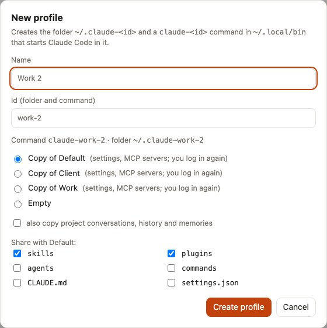

# Separate work and personal

One Claude Code profile for everything mixes your contexts: work memories show up in personal projects, the work `CLAUDE.md` applies to your side projects, and one account's limits cover both. This guide gives work its own profile in about five minutes, and makes `claude` pick the right one by itself.

The example assumes your work code is under `~/code/work` and the rest under `~/code/personal`. Use your own folders.

## 1. Create the Work profile

In the **Profiles** tab, click **+ New profile**:

- **Name**: `Work`. **Id**: `work`, which gives the folder `~/.claude-work` and the command `claude-work`.
- **Base**: *Copy of Default* to start with your current settings, skills and MCP servers, or *Empty* for a clean slate. Leave conversations unticked: the next steps move the work ones.
- **Share with the source profile**: keep *skills* and *plugins* ticked if you want the same ones in both profiles.

See [Profiles and sharing](../guides/profiles.md#create-a-profile) for every option.

<picture>
  <source media="(prefers-color-scheme: dark)" srcset="../assets/screenshots/newprofile-dark.jpg">
  
</picture>

## 2. Log in

Login credentials are never copied, so the new profile signs in once:

```sh
claude-work
```

Then type `/login` and choose your work account. If `claude-work` is not found, `~/.local/bin` is missing from your `PATH`: see [Getting started](../getting-started.md#starting-claude-code-in-a-profile).

## 3. Tell cc-profiles which projects are work

In the **Projects** tab, find a project under `~/code/work`, click **Assign…** and enter `code/work` → *Work*. Every current and future project whose path contains `code/work` now belongs to Work. Add `code/personal` → *Default* the same way if you like the list tidy.

## 4. Move the work projects

The work projects still have their conversations and memories in Default, so the tab lists them under **Needs attention** with **Move to Work**. Click it on each one. Before confirming, *Show the files and folders it touches* lists everything that moves: conversations, memories, file snapshots, prompts and per-project settings.

Close the Claude Code sessions open in those projects first: a running session could write the old settings back. See [Move a project to another profile](move-a-project.md) for details.

## 5. Let `claude` pick the profile

In the **Profiles** tab, turn on **Profile by folder**. From the next terminal, `claude` in `~/code/work/api` starts the Work profile, and anywhere else the default one. Check it without starting Claude Code:

```sh
cc-profiles which ~/code/work/api        # Work
cc-profiles which ~/code/personal/blog   # Default, or nothing when no rule matches
```

See [Profile by folder](../guides/profile-by-folder.md).

## 6. Tidy the general memories

Memories of your home project load in every session. Open the **Memories** tab, pick *Default* and your home project, and move the work-only ones to the home project of *Work* with **Move…**.

Everything above is in the **Backups** tab: each step can be restored on its own.
