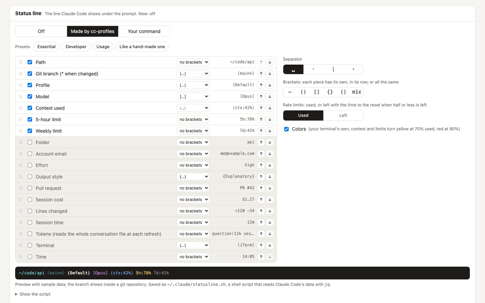

# Showing the profile in the status line

Claude Code can run a script to draw a [status line](https://code.claude.com/docs/en/statusline) at the bottom of the terminal. With several profiles, it is useful to see which one you are in.

<picture>
  <source media="(prefers-color-scheme: dark)" srcset="assets/screenshots/statusline-dark.jpg">
  
</picture>

## From the Settings tab

**Settings → Status line** sets it up without writing anything by hand:

- **Made by cc-profiles**: tick what to show (path or folder, git branch with `*` when there are uncommitted changes, profile, account email, model, effort, output style, pull request, context used, session cost, lines changed, session time, tokens, 5-hour and weekly limits, terminal, time), put it in order by dragging or with the arrows, give each piece its brackets (none, `( )`, `[ ]`, `{ }` or `⟨ ⟩`, or the same for all), pick the separator, how to show the rate limits and whether to use colors, and check the preview. With colors on, each piece has its own color from your terminal's palette and the context and limits turn yellow at 70% used and red at 90%. **Show the script** shows what will be saved. The script sets `LC_ALL=C`, so brackets like `⟨ ⟩` survive a shell with a broken locale.
  - **Tokens** shows `question:12k session:1.2M`: the tokens since the last prompt you typed (tool results do not count as prompts) and in the whole session, adding up input, cache and output tokens of every reply. It reads the conversation file Claude Code passes (`transcript_path`) at each refresh, so on a very long session it costs a little time; without the file it shows nothing.
  - **Rate limits: Used** shows the share of each limit used (`5h:78% 7d:41%`). **Left** shows the share left instead and, once half or less is left, the time until it resets: `5h:22%→1h20m 7d:59%` (`3d11h`, `2h13m`, `45m`, or `<1m` in the last minute). The colors still follow the share used. Scripts saved before this option show the share used.
  - **Presets** fill the editor in one click; nothing is saved until **Save status line**, and you can change anything afterwards. The preset that matches what the editor shows is selected:

    | Preset | Shows | Brackets | Separator | Limits |
    |---|---|---|---|---|
    | Essential | profile, model, context | none | `·` | |
    | Developer | path, branch, profile, model, context (the editor's starting point) | each piece's own | space | |
    | Usage | model, tokens, cost, 5-hour and weekly limits | none | `\|` | left |
    | Like a hand-made one | path, branch, profile, email, model, output style, tokens, context, 5-hour and weekly limits, terminal | each piece's own | space | left |

    All of them use colors. They are defined in `STATUS_PRESETS` (`settings.py`).
- **Your command**: any command; cc-profiles saves it and never runs it.
- **Off**: removes `statusLine` (the script cc-profiles wrote goes to the backup).

Padding, a refresh interval and hiding the vim mode indicator apply to both. **Apply to all…** gives every other profile the same status line, each with its own script, in one backup.

The rest of this page is for writing the script yourself.

## The `label` command

```sh
cc-profiles label
```

prints the name of the profile in use. It reads `CLAUDE_CONFIG_DIR` (or `~/.claude` when it is not set), looks for the profile with that folder in `~/.cc-profiles/config.json`, and prints its label. If the folder is not a known profile, it prints the suffix of the folder name (`~/.claude-test` → `test`), or `default`. It does not start the server and returns immediately.

## A minimal status line

`~/.claude/statusline.sh`:

```sh
#!/bin/sh
input=$(cat)                                   # JSON that Claude Code sends on stdin
model=$(printf '%s' "$input" | jq -r '.model.display_name // empty')
profile=$(cc-profiles label 2>/dev/null)
printf '(%s) %s' "$profile" "$model"
```

and in the profile's `settings.json`:

```json
{
  "statusLine": { "type": "command", "command": "sh ~/.claude/statusline.sh" }
}
```

To use the same script in every profile, [share](guides/profiles.md#share-items) `settings.json`, or point each profile's `statusLine` to the same script. The script finds the right profile by itself, because Claude Code passes `CLAUDE_CONFIG_DIR` down to it.

## Without calling cc-profiles

The status line runs often. If you prefer not to start Python each time, read the label straight from the config with `jq`:

```sh
dir=$(cd "${CLAUDE_CONFIG_DIR:-$HOME/.claude}" && pwd -P)
profile=$(jq -r --arg d "$dir" --arg h "$HOME" \
  '.profiles[] | select((.dir | sub("^~"; $h)) == $d) | .label' \
  "$HOME/.cc-profiles/config.json" 2>/dev/null | head -1)
```
